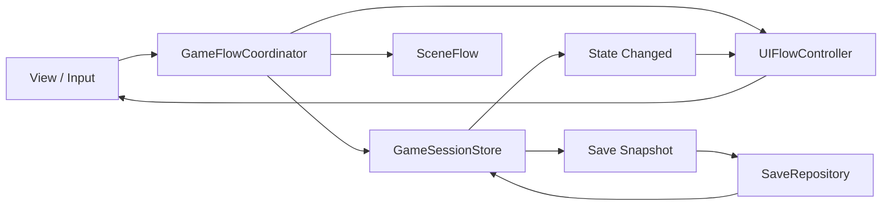

# Aftertaste 아키텍처 리팩터링 플랜

상태: Phase 0 진행 중 · 배포 보류

대상: Unity 6000.3.2f1 / WebGL

목표: 저장 상태, 게임 흐름, UI 흐름의 결정권을 각각 한 곳으로 일원화하고 원하는 상태에서 즉시 테스트할 수 있게 한다.

## 1. 핵심 결정

일원화는 거대한 Manager 하나가 모든 일을 하는 구조가 아니다. 책임별 최종 결정권자를 하나만 둔다.

| 책임 | 유일한 권한자 | 하지 않는 일 |
|---|---|---|
| 저장 가능한 게임 상태 | `GameSessionStore` | 파일 I/O, 화면 조작 |
| 저장·로드·마이그레이션 | `SaveRepository` | 실시간 상태 소유, 게임 규칙 실행 |
| 페이즈·행동·씬 진행 | `GameFlowCoordinator` | 직접 UI 계층 조작 |
| 화면·모달·입력 소유권 | `UIFlowController` | 게임 규칙과 영속 상태 변경 |
| 실제 Unity 표시 | View/Presenter | 전역 상태 직접 탐색·변경 |

상태도 책임별로 구분한다.

- `GameSessionState`: 저장 대상. Progress, Stats, Inventory, Garden, Shop, Mall/Orders, Recipes/Menu, Tutorial.
- `GameFlowState`: 현재 진행 중인 전환과 작업. 저장 여부는 명시적으로 결정.
- `UIState`: 현재 화면, modal stack, overlay, input mode. 기본적으로 저장하지 않음.
- 파생 값은 저장하지 않고 원본 상태에서 다시 계산한다.

## 2. 반드시 지킬 규칙

1. 저장 대상 상태는 서비스 내부 컬렉션이나 static 필드에 중복 보관하지 않는다.
2. 상태 변경은 명시적인 command/use case를 통해서만 수행한다.
3. `SaveRepository`는 Singleton이나 씬 오브젝트를 탐색하지 않고 snapshot만 입력받는다.
4. 로드는 전체 검증 성공 후 Store를 한 번에 교체한다. 부분 적용은 금지한다.
5. 핵심 흐름은 성공·실패·취소 결과를 반환한다. 예외를 로그로 삼킨 뒤 완료 처리하지 않는다.
6. UI visibility와 입력 차단은 `UIFlowController`만 변경한다.
7. 신규 코드에서 `.Instance`, `Find*`, UI static flag를 늘리지 않는다.
8. 씬과 View는 주입받은 인터페이스만 사용한다.
9. 기능 이전은 adapter를 이용한 점진 교체로 진행한다. 전면 재작성은 하지 않는다.

## 3. 현재 배포 차단 조건

- EditMode 테스트는 196개가 발견되며, Test Runner 기준 193개 통과·실패 0건이다. 보호 범위는 주로 단위·도메인 로직에 한정된다.
- PlayMode 테스트 파일이 없어 씬 전환, UI 중첩, binding, 저장 왕복을 보호하지 못한다.
- 게임 세이브 I/O는 안전한 경계로 옮겼지만 상태 캡처와 적용 책임은 아직 여러 서비스에 분산돼 있다.
- Release 빌드 과정이 테스트와 scene/prefab validation을 강제하지 않는다.
- 현재 작업 트리 변경을 반영한 검증된 Release 산출물이 없다.

## 4. 단계별 실행 계획

### Phase 0 — 기준선과 회귀 방지

현재 진행: EditMode 196개 발견, 193개 통과·실패 0건. 기존 실패 8건의 명세 동기화와 중복 사이드 집계 결함 수정 완료. 레거시 의존성 증가를 막는 architecture budget 5종 적용.

- 완료: 기존 실패 8개의 기준을 GDD와 동기화한다.
- 기존 주요 버그를 재현 가능한 테스트 또는 Scenario로 기록한다.
- 빌드와 무관하게 EditMode 테스트를 항상 녹색으로 만든다.
- 완료: `.Instance`, `Find*`, static UI state 증가를 감지하는 architecture check를 추가한다.

완료 조건:

- EditMode 전체 통과.
- 주요 버그마다 재현 절차 또는 자동 테스트 존재.
- 이후 리팩터링에서 비교할 baseline 확정.

PlayMode 기준선: `ConfirmModalPlayModeTest` 1/1 통과. 실제 Canvas 모달 표시와 UI 잠금 획득·해제, 레시피북·설정·도시락 선택의 상호 배타성을 검증한다. 다음 시나리오는 씬 전환 후 UI 잠금 해제와 저장 후 재진입이다.

### Phase 1 — GameSessionStore와 안전한 저장

완료: `SaveRepository`가 schema version, 임시 파일 검증, backup, 원자적 교체, backup 복구와 명시적 성공/실패를 담당한다. 마이그레이션은 신규 저장 성공 후에만 구파일을 삭제한다. `GameSessionStore`와 `NewGameStateFactory`를 도입했고 Inventory·도시락 선택·레시피 해금·배달 주문·상점 구매·일일 정산 런타임 상태를 Store 소유로 이전했다.

- `NewGameStateFactory`와 완전한 `GameSessionState`를 만든다.
- `GameSessionStore`를 유일한 저장 상태 소유자로 둔다.
- 기존 API를 유지하는 adapter를 두고 상태를 순서대로 이전한다.
  1. Progress / Stats
  2. Inventory
  3. Garden / Shop upgrades
  4. Orders / Delivery / Menu / Unlocks / Tutorial
- `schemaVersion`을 포함한 Save DTO를 정의한다.
- `임시 파일 기록 → 재검증 → backup → 원자적 교체`로 저장한다.
- 버전별 migration과 손상·중단·구버전 입력 테스트를 추가한다.

완료 조건:

- 저장 대상 상태를 서비스가 별도로 소유하지 않음.
- snapshot round-trip 후 상태가 완전히 동일함.
- 저장 실패 시 기존 세이브와 현재 세션이 보존됨.
- migration 성공 후에만 구파일 삭제.

### Phase 2 — 즉시 시작 가능한 Test Scenario

- production 기본값을 사용하는 `ScenarioBuilder`를 만든다.
- `TestScenario`가 Scene, SessionState, FlowState, UIState, seed를 정의하게 한다.
- Editor 메뉴와 Development 전용 launcher에서 한 번에 실행한다.
- 자동 PlayMode 테스트도 같은 Scenario를 사용한다.
- 실제 사용자 세이브와 완전히 분리된 임시 profile을 사용한다.

우선 Scenario:

- Cooking: 주문 대기 / 마지막 손님 / 영업 종료 직전
- Shop: 돈 부족 / 저장고 가득 참
- Garden: 수확 가능
- Mall: 배달 완료 직전 / 각 phase action
- Settlement: 수입·지출 포함 Day 종료
- Tutorial: 메뉴 선택과 Cooking의 각 주요 checkpoint
- Save: 현재 버전 / 구버전 / 손상된 파일

완료 조건:

- 위 상태를 처음부터 플레이하지 않고 한 번의 실행으로 재현 가능.
- 같은 seed와 Scenario는 같은 상태를 재현.
- 수동 QA와 자동 테스트가 동일한 Scenario 정의를 사용.

### Phase 3 — GameFlow 일원화

- phase/action/day 진행을 명시적인 상태 머신으로 만든다.
- Scene load, 저장 시점, 날씨, 정산, 인벤토리 만료를 flow command의 효과로 조정한다.
- View와 씬 컨트롤러의 직접 `PassPhase`, `LoadScene`, `SaveAll` 호출을 제거한다.
- 모든 전환은 `Result`를 반환하고 성공한 경우에만 다음 상태를 commit한다.

완료 조건:

- 주요 진행 경로가 `GameFlowCoordinator` 밖에서 시작되지 않음.
- 실패·취소 시 부분 상태나 잘못된 현재 Scene 기록이 남지 않음.
- 새 게임, 이어하기, 하루 전체 진행을 PlayMode로 검증.

### Phase 4 — UIFlow 일원화

- `UIState`에 current screen, modal stack, overlay, input mode를 정의한다.
- owner `HashSet` 잠금을 scoped token/lease 방식으로 교체한다.
- UI 열기/닫기와 ESC 정책을 route/state machine으로 이동한다.
- Tutorial 예외와 각 화면의 static flag를 화면별로 제거한다.
- View는 UIState를 렌더링하고 사용자 intent만 전달한다.

이전 순서:

1. Loading / Confirm / Settings
2. PhaseSelection / BentoSelection
3. RecipeBook / Shop / Inventory
4. Dialogue / Tutorial
5. Cooking drag·minigame UI

완료 조건:

- 동시에 존재할 수 없는 UI 조합을 상태로 표현할 수 없음.
- 입력 소유자가 항상 하나로 결정됨.
- 화면 파괴·취소·씬 전환 후 token 누수가 없음.
- UI 표시와 binding을 PlayMode 테스트로 검증.

### Phase 5 — Release Gate

Release 빌드 전에 다음을 자동 실행하고 하나라도 실패하면 빌드를 중단한다.

1. 컴파일과 architecture check
2. EditMode unit/contract test
3. 모든 build scene과 prefab의 serialized reference validation
4. 핵심 PlayMode flow test
5. 핵심 해상도 screenshot regression
6. WebGL 실행, 저장, 새로고침 smoke test
7. commit SHA와 save schema version을 산출물에 기록

완료 조건:

- 깨끗한 commit에서 전체 gate 통과.
- 해당 commit으로 생성된 Release WebGL 산출물 확인.
- P0/P1 버그가 없고 세이브 호환성 확인.

### Phase 6 — 레거시 제거

- `_Temp*.cs`, 과거 prefab, 사용하지 않는 interface와 fallback을 참조 감사 후 제거한다.
- `tmp/refactor-2026-05`는 현재 규칙과 분리해 archive한다.
- README, GDD, architecture 문서의 용어와 실제 코드 구조를 맞춘다.
- migration은 지원 기간과 제거 조건을 기록한다.

## 5. 테스트 전략

| 계층 | 무엇을 검증하는가 | 원칙 |
|---|---|---|
| Domain unit | 가격, 재고, 레시피, 점수 | 많고 빠르게 유지 |
| State transition | command 전후 전체 상태와 event | 핵심 회귀 방어선 |
| Save contract | round-trip, migration, 손상, 쓰기 실패 | 배포 필수 |
| EditMode asset | scene/prefab 참조, catalog ID | 모든 build asset 대상 |
| PlayMode integration | 실제 scene, UI visibility, input, binding | 주요 Scenario 대상 |
| Screenshot | 겹침, 잘림, 화면비 | 핵심 화면만 허용 오차 사용 |
| WebGL E2E | 빌드 부팅과 영속 저장 | 소수의 smoke journey |

화면 검증은 픽셀 비교에만 의존하지 않는다. 우선 active state, CanvasGroup, raycast, interactable, RectTransform 화면 포함 여부, sorting, 표시 텍스트와 Store 값의 일치를 구조적으로 검증한다.

## 6. 작업 원칙과 배포 판단

- 새 버그는 `Scenario/재현 테스트 → 중앙 책임으로 이전 → 수정 → 우회 코드 제거` 순서로 처리한다.
- 한 Phase에서 전체 시스템을 동시에 바꾸지 않고 vertical slice 단위로 이전한다.
- 기존 behavior가 불명확하면 코드, GDD, 테스트 중 무엇이 기준인지 먼저 결정한다.
- 리팩터링 도중에도 항상 실행 가능한 상태를 유지한다.
- Phase 0~5가 완료되기 전에는 배포하지 않는다. Phase 6의 정리는 배포 후에도 계속할 수 있다.

## 7. 추적 중인 임시 자산

- `item_caramelTopping_plate.png`는 T005의 암묵적 raw fallback을 제거하기 위해 `item_caramelTopping_raw.png`를 복제한 임시 이미지다. 최종 T005 전용 아트가 준비되면 같은 경로의 PNG 내용만 교체한다.
